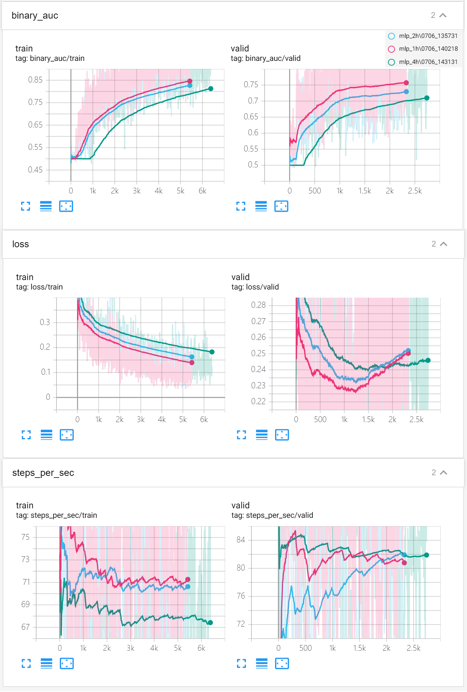
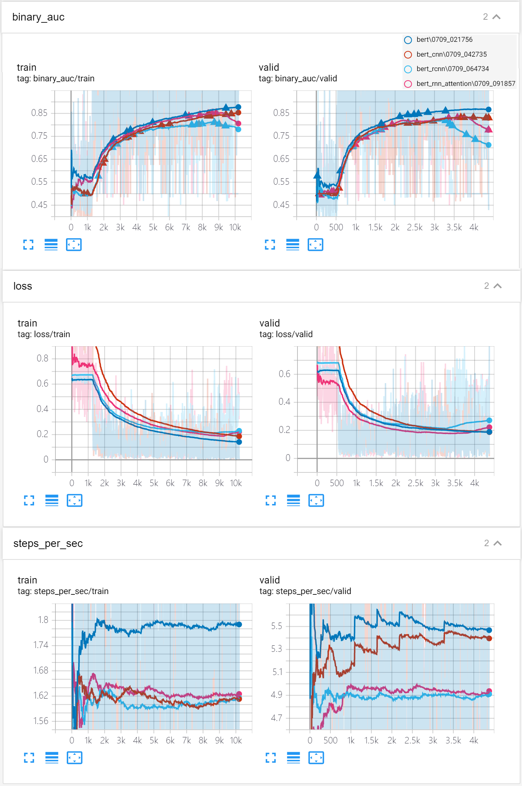

# aspect-based sentiment-analysis
# the code/model is updating...

## 框架
- PyTorch
- huggingface/transformers
- scikit-learn
- pandas
- Matplotlib
- synonyms

## 模型
- MLP
  - MLP1H
  - MLP2H
  - MLP6H
- BERT
  - BERT
  - BERT+Bi-LSTM+Attention

## 训练过程
- MLP1H， MLP2H， MLP6H

- BERT， BERT+TextCNN2D， BERT+Bi-LSTM+Attention， BERT+RCNN 

